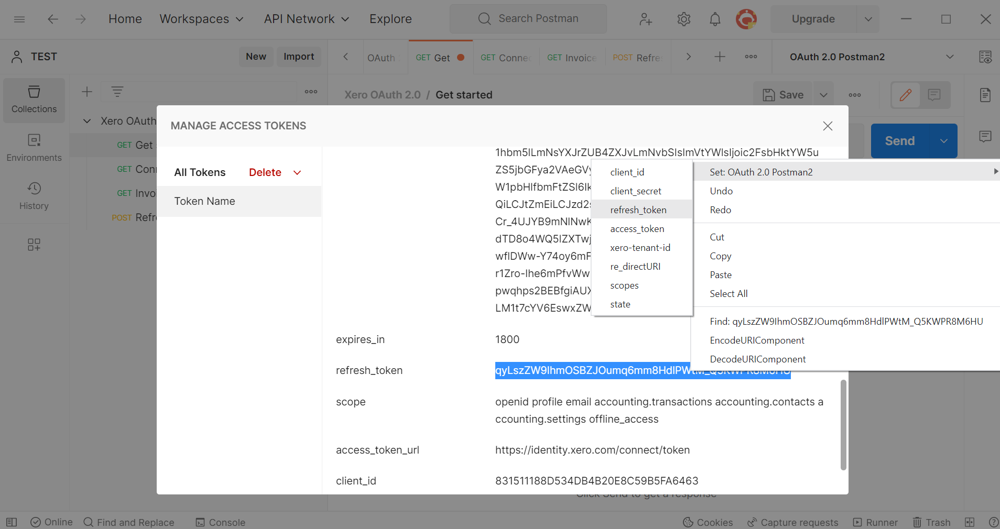

# Xero-Postman OAuth 2.0
A Postman collection for authenticating to the Xero API. 

## Steps to get up and running
Follow these steps to quickly get up and running with the Xero API and Postman:

### 1. Import the Xero OAuth 2.0 collection and Xero environment into Postman
Click the button below and select the Desktop version of Postman (Chrome extension doesn't support environment variables). This will also install the Collection and Environment we'll be using.

[](https://app.getpostman.com/run-collection/d069793e904f7602770d#?env%5BOAuth%202.0%5D=W3sia2V5IjoiY2xpZW50X2lkIiwidmFsdWUiOiIiLCJlbmFibGVkIjp0cnVlfSx7ImtleSI6ImNsaWVudF9zZWNyZXQiLCJ2YWx1ZSI6IiIsImVuYWJsZWQiOnRydWV9LHsia2V5IjoicmVmcmVzaF90b2tlbiIsInZhbHVlIjoiIiwiZW5hYmxlZCI6dHJ1ZX0seyJrZXkiOiJhY2Nlc3NfdG9rZW4iLCJ2YWx1ZSI6IiIsImVuYWJsZWQiOnRydWV9LHsia2V5IjoieGVyby10ZW5hbnQtaWQiLCJ2YWx1ZSI6IiIsImVuYWJsZWQiOnRydWV9LHsia2V5IjoicmVfZGlyZWN0VVJJIiwidmFsdWUiOiIiLCJlbmFibGVkIjp0cnVlfSx7ImtleSI6InNjb3BlcyIsInZhbHVlIjoiIiwiZW5hYmxlZCI6dHJ1ZX0seyJrZXkiOiJzdGF0ZSIsInZhbHVlIjoiIiwiZW5hYmxlZCI6dHJ1ZX1d)

Alternatively, you can download the Xero OAuth2.0.postman_collection and OAuth 2.0.postman_environment JSON files above and import them via the Import button in the top left of the Postman Workplace sceen.

### 2. Create an OAuth2 app at https://developer.xero.com/myapps
Go to the Xero developer portal and create an OAuth2 app.

If you haven't already signed up for a xero account you can do so [here](https://www.xero.com/signup/api/).

Use the following values:
* App Name - your choice, but can't contain the word 'Xero'
* Company or application URL - this needs to be an https address, but isn't used.
* OAuth 2.0 redirect URI - also needs to be https but won’t be used in Postman

Click Create App

Then:
1. Click Configuration from the left hand side of the screen
1. Click Generate a secret
1. Keep the page open

### 3. Add your first set of environment variables in Postman
Copy the Client id, Client secret and OAuth 2.0 redirect URI from the My Apps screen into the environment variables in Postman. To add these details to the Environment, make sure you have the OAuth 2.0 Environment selected, click the eye button, then edit.

### 4. Add the scopes for the endpoints you will be accessing.
Our Developer Center lists the available scopes [here](https://developer.xero.com/documentation/oauth2/scopes). For getting started you will need at least:

`offline_access accounting.transactions`

In addition, to make further test calls we would also suggest adding:

`openid profile email accounting.contacts accounting.settings`

Add the scopes required to the `scopes` environment variable.

### 5. Generate your access token
1. Double-click on the GET Get Started request under the Xero OAuth 2.0 Collection
1. Select the Authorization tab
1. Scroll down to the Configure New Token section

1. Add the Variable names surrounded by {{}} from your Environment into the fields, as shown in the screenshot below
1. Add https://login.xero.com/identity/connect/authorize to the Auth URL field
1. Add https://identity.xero.com/connect/token to the Access Token Field
1. Click Get New Access Token

At this stage you will be prompted to log in to Xero. 

You'll then be taken through to the Organisation Select window. If you've included the `openid profile email` scopes, you'll be asked to access your basic profile information as well as other data relevant to the scopes requested.
Select the Organisation you want to connect to. If you want to connect to more than one Organisation, you can repeat the steps above and select another Organisation. 

Once complete you'll be passed back to Postman.

### 6. Set your Access and Refresh Tokens
We now have the last remaining tokens needed to access the Xero API. These need to be set to the Environment Variables, to do this:
1. Highlight the Access Token
1. Right-click on it
1. Select Set: OAuth 2.0 > access_token

Scroll down the Manage Access Tokens pop up and follow a similar process for the Refresh Token:
1. Highlight the Refresh Token
1. Right-click on it
1. Select Set: OAuth 2.0 > refresh_token

### 7. Find out which tenants (organisations) we are connected to

1. Double-click on the GET Connections request
1. Click Send (If this results in an error you may need to run the Token Refresh call first)
1. Like we did for the Access and Refresh Tokens, highlight the tenantId from the response, right click and select Set > OAuth 2.0 > xero-tenant-id

Congrats! You're now authenticated and can start making API calls. Your access token will last for 30mins, after which time you'll need to refresh the token. 

### 8. Make your first API call!
1. Double-click to load the GET Invoices request
1. Ensure No Auth is set on the Authorization tab
1. Click Send

### 9. Refreshing the token
1. Double-click to load the POST Refresh token request
1. Ensure No Auth is set on the Authorization tab
1. Click Send

### Notes:
* We use the built in OAuth 2.0 support to get the token, however we then set this as an environment variable. So we don't need to use this support when making the normal API calls.
